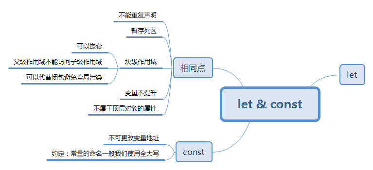
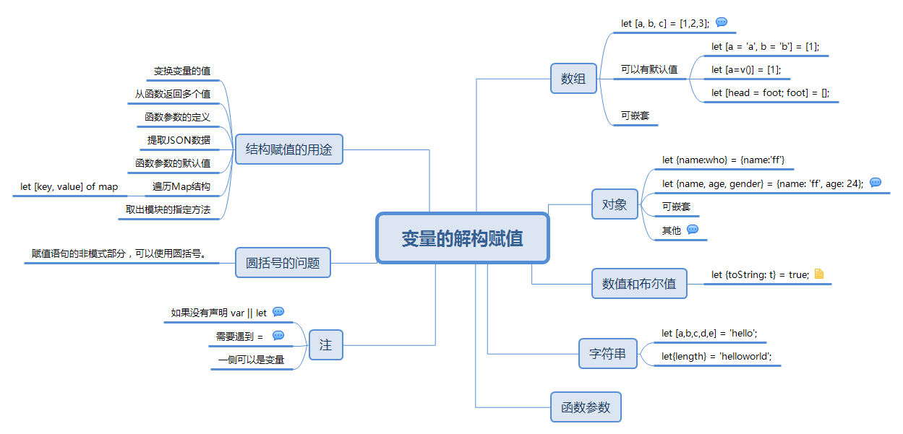
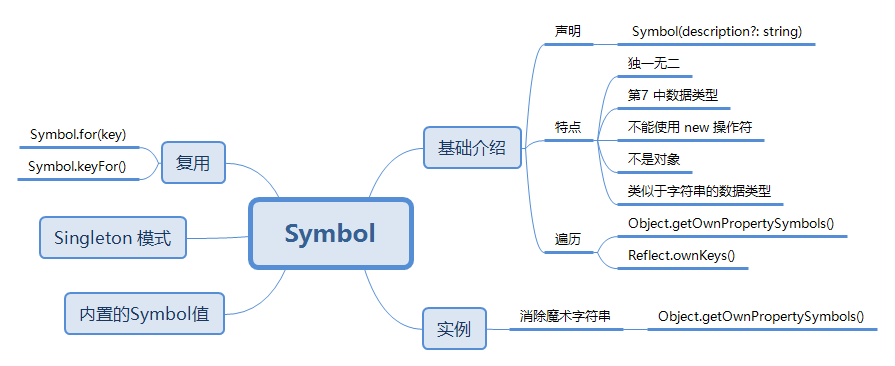
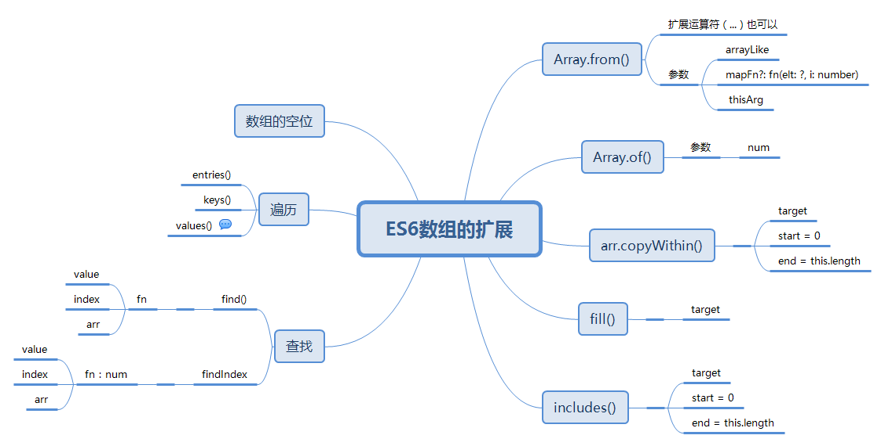
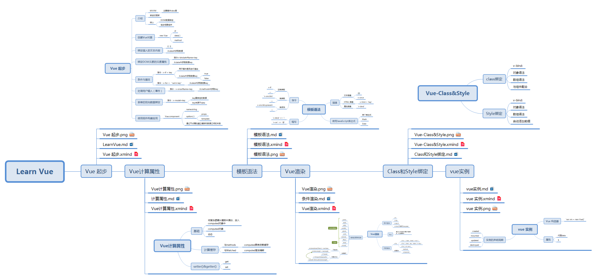

## 对以往的学习进行回顾，整理/重写了部分笔记，并对部分笔记制作了思维导读方便复习，部分如下；

### JavaScript高程
高程3是一本十分好的书籍，第一遍没看懂，直到对js的基础知识有了大致了解以后，才觉得这本书的厉害之处，所以进行第二遍的学习，记录了相关笔记  
`https://github.com/fortress-fight/readingForJS/tree/master/JavaScript%E9%AB%98%E7%A8%8B`  
>部分笔记记录的时间较早，有待于二次整理

附上部分笔记中的思维导图：  

1） 在HTML中使用JavaScript

2）JavaScript简介

3）变量和作用域及内存问题

4）基本概念

5）引用类型

6）面向对象

7）JSON

### 锋利的jQuery

https://github.com/fortress-fight/readingForJS/tree/master/%E9%94%8B%E5%88%A9%E7%9A%84jQuery

锋利的jQuery -- 学习jQ的入门级图书，对于jQ的方法介绍还是比较准确的，但是jQ经常更新，所以看文档依旧是最好的方法

 1）JQ选择器

 

 2）JQ DOM 操作

 

 3）JQ 事件相关

 

 4）jQuery与Ajax的应用

 

### JavaScript设计模式与开发实践

https://github.com/fortress-fight/readingForJS/tree/master/JavaScript%E8%AE%BE%E8%AE%A1%E6%A8%A1%E5%BC%8F%E4%B8%8E%E5%BC%80%E5%8F%91%E5%AE%9E%E8%B7%B5

感谢这一本书：

1）基础知识

2）设计模式

### 阮一峰 ES6

https://github.com/fortress-fight/LearnES6

ES6 已经不算是新的东西了，但是真正的接触也仅仅有几周的时间，仍在学习中

- Let和Const

- 变量的解构赋值

- Symbol

- ES6对象的扩展

- ES6数组的扩展

### vue 官方文档

vue 框架，正在学习中.....

1）level1

https://github.com/fortress-fight/LearnVue

