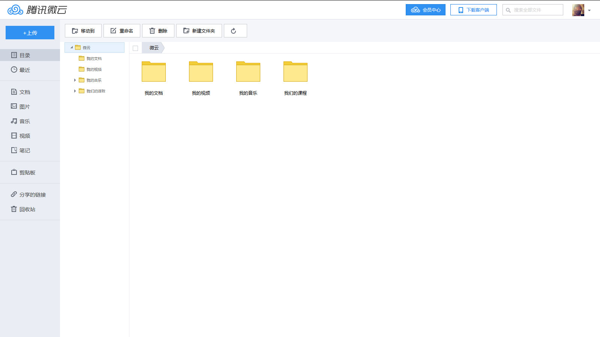
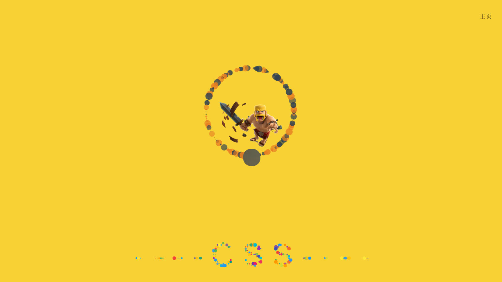

## Tencent-WeiYun

[地址](https://fortress-fight.github.io/others/Tencent-WeiYun/)

简介：实现网盘的基本功能；

## TeamProject

简介：  
小组项目：  
实现功能：
1. 粒子文字
2. 粒子动画
3. 音乐可视化
4. 2D/3D 照片墙

个人：  
职位：组长  
指责：  
- 协调进度，指定方案
- 实现粒子文字以及粒子动画效果
- 实现页面过渡
- 实现功能整合
- 与组员配合实现音乐可视化

附上 实现 canvas 功能的方法：
[canvas](./file/canvas.js)
