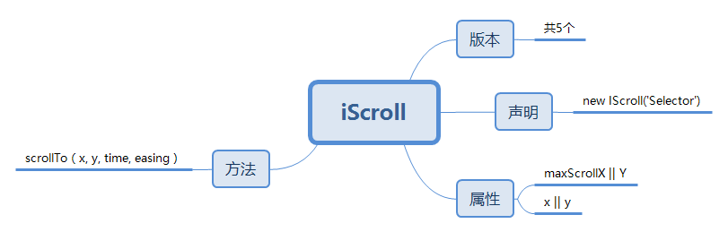

# 简历
### 基本信息：
- 姓名： 付飞  &nbsp;&nbsp;&nbsp; 学历：本科
- 联系方式： 132-9560-6605
- 邮箱：jndxfu@163.com
- GitHub: &nbsp; [fortress-fight](https://github.com/fortress-fight)
- 状态：待职

### 个人作品：


作品地址：
[resume](https://fortress-fight.github.io/)  
原网址：
[adisonpartners](http://www.adisonpartners.com/)

### 作品简介：

周期：5天

布局方式选用了百分比布局，兼用了移动端、由于设备有限，仅仅在ipad、iPhone5、iPhone6 的 微信 和Safari浏览器中进行了测试，表现良好；

功能实现：

- 布局：
通过媒询和百分比布局实现页面的响应式处理：  
适配屏幕：  
>超小屏幕 手机 (<460px)
超小屏幕 手机 (<560px)  
小屏幕 平板 (≥760px)  
中等屏幕 桌面 (≥1000px)  
大屏幕 桌面 (≥1360px)  
高分辨率 桌面 (≥1410px)

- 使用 sass 完成预处理，增强布局效率

- Loading 动画的实现

    通过图片load的监听事件，监控图片加载配合动画帧完成Loading动画的实现

- 页面切换效果

    通过观察，几种页面切换中，存在相同功能，仅仅是内容存在差异；所以通过面向对象的方式，实现功能的复用，并且创建一个配置参数，以便于适应各种区别；  

    主要实现功能：  

     >页面切换的动画效果||自动切换 || 切换下一主题 || 切换上一主题

    为了更好地复用，以及其余页面的需求，尽可能的实现了单一职责，并且向外提供了一些接口：  
>    1. 自动切换功能--`autoPlay`
>    2. 检测是否处于运动状态--`isAutoPlay`
>    3. 关闭自动切换--`stopAutoPlay`
>    4. 设置当前状态 -- `now`
>    5. 切换为下一组 -- `next`
>    6. 切换为上一组 -- `prev`
>    7. 检测是否可以进行切换 -- `isReady`

    通过不同的结构设计，大大简化了原网站的布局结构，以相同结构完成了不同页面、不同主题、不同需求的页面展示；

部分代码：
```
function setMainImage (id) {
	this.obj = $(id);
	this.bg = $('.bg');
	this.face = $('.face');
	this.nowIndex = 0;
	this.setting = {
		data: [],
		bgData: [],
		len: 12,
		bgSize: [1920, 1200],
		bgRota: 1920 / 1200,
		hideFn: function () {
			return false;
		},
		showFn: function () {
			return false;
		},
		isReady: false,
		title: [],
		infor: [],
		hash: []
	};
	this.init();
}
setMainImage.prototype = {......}
```

以菜单页为例：

```
var menuPage =  new setMainImage('#mainImagArea');
menuPage.init({
    data: [
        'img/bg.jpg'
    ],
    showFn: function () {
        centerBoxScroll.scrollTo(0, 0);
        $('#menuBox').fadeIn(400, function () {
            menuBox.showBox();
            menuCanTab = true;
            centerBoxScroll.refresh();
        });
    },
    hideFn: function (title, infor) {
        menuCanTab = false;
        menuBox.hideBox();
        $('#centerBox').fadeOut(400)

    }
});
```

- 页面标题  
页面标题的切换在各个页面中也是重复次数较多的功能，所以也将其做了简单处理：并且在使用的时候通过函数传递的方式，与页面切换建立起联系；

```
function IntroBox (selector) {
	this.obj = $(selector);
	this.spanBox = this.obj.find('span');
}

IntroBox.prototype = {
	constructor: IntroBox,
	inite: function () {
	},
	showBox: function () {
		this.obj.fadeIn(300);
		this.spanBox.each(function (i, e) {
			$(e).attr({
				style: ''
			})
		})
	},
	hideBox: function (fn) {
		this.obj.fadeOut(800, function () {
			fn && fn();
		});
		this.spanBox.each(function (i, e) {
			$(e).width(0);
			$(e).height(0);
		})
	}
}
```

- 页面的切换  
通过检测页面hash的变化实现页面的切换

- 页面详情  
页面的详细内容是通过数据导入的，布局采用了，并且通过`dealData`实现结构的生成；
如下：
```
var	pageData = [
	{
		index: 0,
		title: 'HTML/CSS',
		con: [
			{
				h: 'You cannot leave ,real warrior never quits.',
				p: [
					'...'
				]
			},
			...
		]
	},
	{
		index: 1,
		title: 'HTML5',
		con: [...]
	},
...
```

- 适配移动端  
1）设备检测：
```
var isMobile = false;
if( /Android|webOS|iPhone|iPad|iPod|BlackBerry|IEMobile|Opera Mini/i.test(navigator.userAgent) ) {
　　isMobile = true;
}
```
2) 在禁止默认事件后处理a标签的点击
```
$(window).on('touchstart', function (ev) {
	console.log(ev.target)
})
if (isMobile) {
	var target, old;
	$('a').on('touchstart', function (ev) {
		target = ev.target;
		$('a').on('touchmove', function (ev) {
			target = null;
		});
		$('a').on('touchend', function (ev) {
			old = ev.target;
			if (target == old) {
				window.location = this.href;
			}
		})
	})
}
```
3) 封装了个关于滑动方向的小方法
```
function mobileTools (selector) {
	this.obj = selector;
}
mobileTools.prototype = {
	inite: function (json) {

	},
	getSingle: function (fn) {
		var result;
		return function () {
			return result ||(result = fn.apply(this, arguments));
		}
	},
	on: function (json, target) {
		target = target || document;
		for (attr in json) {
			target.addEventListener(attr, json[attr]);
		}
	},
	sildEvent: function (dir, callback, limite) {
		var startX, startY, endX, endY, disX, dixY, angle,
			_this = this, json = {};
		if (typeof dir == 'object') {
			json = dir;
			limite = callback;
		} else {
			json[dir] = callback;
		}
		limite = limite || 50;

		this.on({
			'touchstart': function (ev) {
				ev = ev.touches[0];
				startX = ev.pageX;
				startY = ev.pageY;
			},
			'touchend': function (ev) {
				ev = ev.changedTouches[0];
				endX = ev.pageX;
				endY = ev.pageY;
				disX = endX - startX;
				disY = startY - endY;

				if (Math.abs(disX) < limite && Math.abs(disY) < limite) {
					return false;
				}

				angle = _this.getAngle(disX, disY);
				trigger();
			}
		});

		function trigger () {
			if (angle >= 45 && angle < 135) {
				json.up && json.up();
			};
			if (angle >= -45 && angle < 45) {
				json.right && json.right();
			};
			if (angle >= -135 && angle < -45) {
				json.bottom && json.bottom();
			};
			if ((angle >= 135 && angle <= 180) || (angle >= -180 && angle < -135)) {
				json.left && json.left();
			};
		};
	},
	getAngle: function (dx, dy) {
		return Math.atan2(dy, dx) * 180 / Math.PI;
	}
};
```

- 下拉刷新  
通过配合 iScroll 插件，实现了移动设备上的下拉刷新；


- 工具  
使用自己封装的一些工具方法（借用的jq的一些方法对其进行管理）
使用了jQuery提升效率
使用了 iScroll插件 实现了滚动条功能，并对其使用方式做了简单的总结


点击查看：
[iScroll简介](./file/iScroll.md.html)


#
