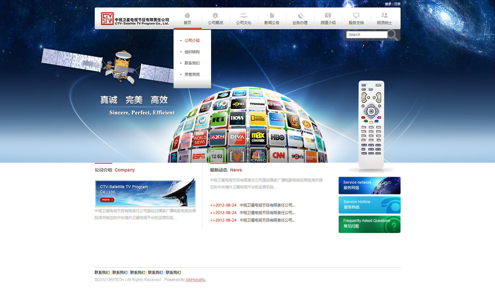
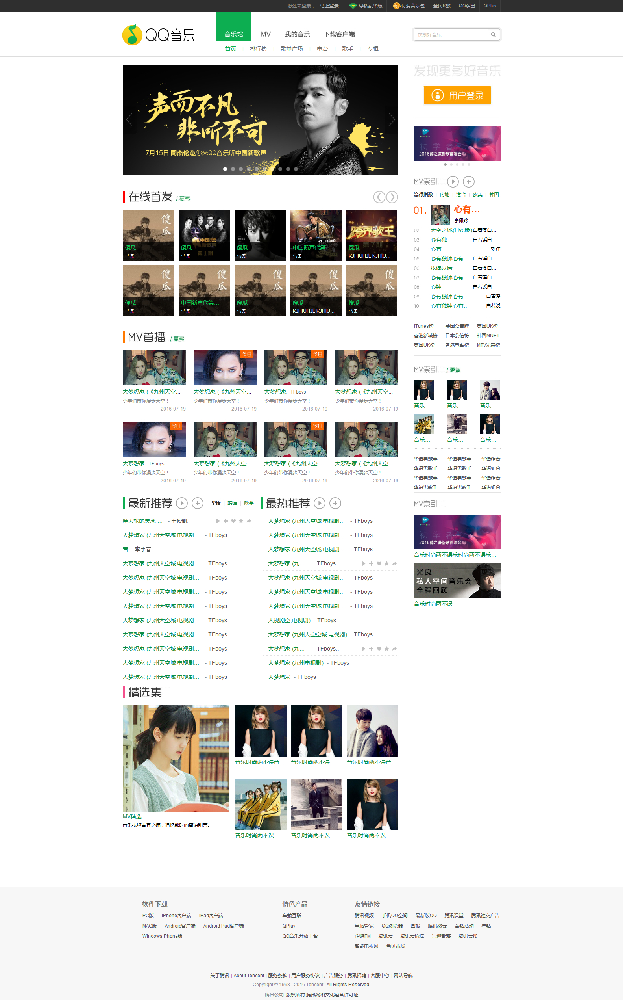
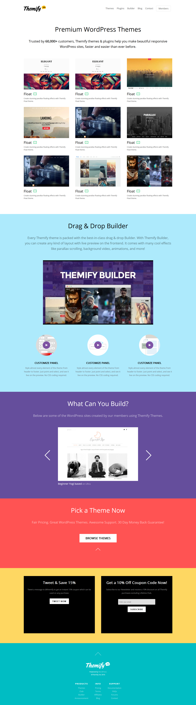

## 在学习HTML/CSS时制作的页面

### 静态页面
兼容IE6

#### 中视卫星

[地址](https://fortress-fight.github.io/others/%E4%B8%AD%E8%A7%86%E5%8D%AB%E6%98%9Fweb/)

简介：这是我制作的第一个完整的web页面，共计子页14个，周期5天

#### QQ音乐

[地址](https://fortress-fight.github.io/others/QQ%E9%9F%B3%E4%B9%90/html/)

简介：这是我制作的第二个完整的web页面，共计子页5个，周期5天

#### 淘宝

[地址](https://fortress-fight.github.io/others/%E6%B7%98%E5%AE%9D%E6%95%B4%E7%AB%99/)

简介：这是我制作的第一个电商页面，周期5天

### 移动端页面（静态）

[地址](https://fortress-fight.github.io/others/%E7%A7%BB%E5%8A%A8%E7%AB%AF%E6%B7%98%E5%AE%9D/html/)

简介：这是我制作的第一个移动端电商页面，周期2天

### 移动端页面（静态）

[地址](https://fortress-fight.github.io/others/%E7%A7%BB%E5%8A%A8%E7%AB%AF%E6%B7%98%E5%AE%9D/html/)

简介：这是我制作的第一个移动端电商页面，周期2天

### 响应式

#### themify
[地址](https://fortress-fight.github.io/others/%E5%93%8D%E5%BA%94%E5%BC%8F/themify/)

简介：这是我制作的第一个响应式，适配各种尺寸的设备；效果以css动画为主，添加了少量的js，周期6天
